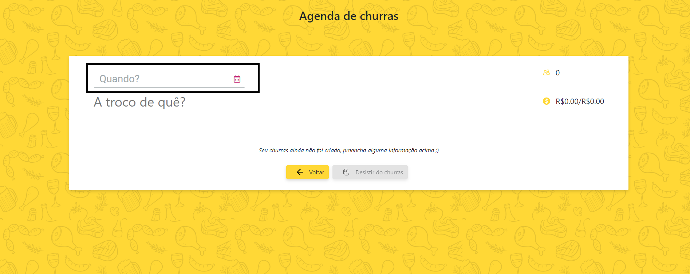

# contr(inc)afile

### Instruções

Execute o arquivo run.bat que está na raíz do repositório (assumi que será executado em um windows  ¯\\_(ツ)_/¯): 
  - publica o *backend* e levanta o servidor no Kestrel na porta 5000; 
    - [Swagger da Api](http://localhost:5000/swagger "Swagger da Api")

- instala as dependências do *frontend* e levanta em um servidor local na porta 4200, essa compilação não é com as otimizações de *prod*.

### Arquitetura do backend
No *backend* foi adotada uma arquitetura baseada em eventos, as *controllers* recebem por injeção de dependência uma *ApplicationService*  que serve como uma fachada para o domínio. As interfaces de *ApplicationServices* estão em um assembly separado por servirem apenas de *proxy* para o domínio ainda que *by-the-book* elas façam parte dele. 

As *ApplicationServices*  concretas criam um *command* através de *builders* e "despacham" os eventos através de um *mediator*. Cada *command* é manipulado por um *commandHandler* que processa a lógica de domínio e pode ou não publicar uma notificação de que o *command* foi manipulado. Cada notificação publicada é manipulada por um *notificationHandler* que executa uma ação baseada na notificação.

A arquitetura também simula um *CQRS* ainda que com a mesma base para escrita e leitura. 
- O assembly *Write* possui repositórios que fazem a escrita do dados no banco através de repositórios usando o *EntityFramework Core*.
- O assembly *Read* possui repositórios de somente leitura que se conecta via ADO utilizando o *Dapper* . As *queries*  são executadas e os resultados são projetados em dtos.

### Usabilidade

**Importante**: o *frontend* não está reponsivo (ainda!) então deve ser executado em um monitor com resolução md, lg ou xl.
O foco na usabilidade da aplicação é salvar automaticamente cada interação do usuário com o sistema;

A primeira tela mostra a listagem dos *churras*. Para adicionar um novo clique em **novo churras**

Ao entrar na tela de novo churras, repare que no rodapé há uma mensagem dizendo que o *churras* ainda não foi criado;

Para criar um novo churras, basta interagir com o campo de data (quando?) ou com o campo de descrição (a troco de quê?);

Ao sair do campo, o *churras* é salvo automáticamente e uma mensagem é exibida no rodapé informando quando o *churras* foi salvo por último; 

Agora podemos dizer quem vai: 

E dizer quem já pagou

Repare no cabeçalho os valores de quanto deve ser arrecadado e o quanto já foi se atualiza; Por padrão as pessoas são adicionadas ao *churras* como se não fossem beber, mas a maioria bebe, certo? então vamos avisar isso; os valores de arrecadação são atualizados.

Caso alguém não vá mais, é uma pena, mas tudo bem. É só clicar na lixeira

Se a aderência não foi a esperada podemos desistir do *churras* 

Mas para organizar outro é só fazer tudo de novo :)
